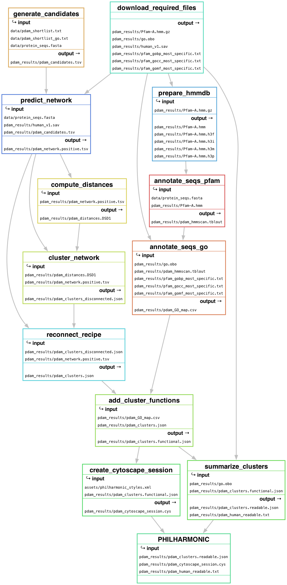

<p align="center">
    
</p>

# Decoding the Functional Networks of Non-Model Organisms

Protein interaction networks are a fundamental tool for modeling cellular and molecular function, and a large and  sophisticated toolbox has been developed to leverage the structure and topological organization of these networks to predict the functional roles of many under-studied genes, proteins and pathways. However, the overwhelming majority of experimental PPIs from which such networks are constructed come from  humans plus a small number of well-studied model organisms.

We introduce PHILHARMONIC: Protein Human-Transferred Interactome Learns Homology And Recapitulates Model Organism Network Interaction Clusters: a novel computational pipeline for de novo network inference and functional annotation in non-model organisms. PHILHARMONIC uses the D-SCRIPT deep learning method, trained on human PPIs, to learn how to predict PPIs directly from amino acid sequence alone to predict interactions genome-wide, then employs DSD coupled with Spectral Clustering  followed by a new method, Recipe to reconnect clusters. While the predicted PPIs will not individually be completely accurate, the clustering step allows us to aggregate the weaker pairwise signal into confident higher-level organization. We show that these clusters have substantial functional coherence, and we apply our method to predict functionally meaningful modules of proteins in the Coral Holobiont, finding interesting clusters in both the coral animal and symbiont.

## Table of Contents

1. [Installation](#installation)
2. [Usage](#usage)
3. [Workflow Overview](#workflow-overview)
4. [Detailed Configuration](#detailed-configuration)
5. [Citation](#citation)

## Installation

```
git clone https://github.com/samsledje/philharmonic.git
cd philharmonic
mamba create -f environment.yml
mamba activate philharmonic
```

You may also want to install [Cytoscape](https://cytoscape.org/) for visualizing the networks.

## Usage

### Required data

The only data that PHILHARMONIC requires is a set of protein sequences in `.fasta` format. You can optionally also provide
a set of GO terms that you want to prioritize in the analsysis, and a subset of your proteins that will definitely be included
in the network (otherwise, we will subsample proteins when proposing candidate interactions, and may not include all proteins in the final network).

### Setting up the config

The `config.yaml` file is where you will specify the parameters for the pipeline. We provide a sample config in this repository
with recommended parameters. You will need to specify the paths to your protein sequences, GO terms, and seed proteins in this file. You can find an explanation for all parameters [below](#detailed-configuration). If you've installed Cytoscape, make sure it is open and running before you start the pipeline. Otherwise, set `build_cytoscape=false` in the configuration. If you use a different configuration file name or location, you can specify it with the `--configfile` flag when running Snakemake.

```yaml
# User Specified
run_name: [identifier for this run]
work_dir: [path to working directory]
sequence_path: [path to protein sequences in .fasta format]
protein_shortlist:  [optional path to a list of proteins that must be included in the network]
go_shortlist: [optional path to a list of GO terms to prioritize in the analysis]
...
```

### Running the pipeline

Once your configuration file is set up, you can invoke the pipeline with

```bash
Snakemake -c {number of cores}
```

### Pipeline Outputs

### Viewing the Results

## Workflow Overview

A detailed overview of PHILHARMNONIC can be found in the [manuscript](#citation). We briefly outline the pipeline below.

Each of these steps can be invoked independently by running `Snakemake -c {number of cores} {target}`. The `{target}` is shown in parentheses following each step below.



1. Download necessary files (`download_required_files`)
2. Run [hmmscan](http://hmmer.org/) on protein sequences to annotate pfam domains (`annotate_seqs_pfam`)
3. Use pfam-go associations to add [GO terms](https://geneontology.org/) to sequences (`annotate_seqs_go`)
4. Generate candidate pairs (`generate_candidates`)
5. Use [D-SCRIPT](https://dscript.csail.mit.edu/) to predict network (`predict_network`)
6. Compute node distances with [FastDSD](https://github.com/samsledje/fastDSD) (`compute_distances`)
7. Cluster the network (`cluster_network`)
8. Use [ReCIPE]() to reconnect clusters (`reconnect_recipe`)
9. Annotate clusters with functions (`add_cluster_functions`)
10. Name and describe clusters with [Langchain](https://www.langchain.com/) (`summarize_clusters`)
11. Compute cluster graph (`cluster_graph`)
12. Visualize in [Cytoscape](https://cytoscape.org/) (`vizualize_network`)

## Detailed Configuration

## Citation

```
TBD
```
