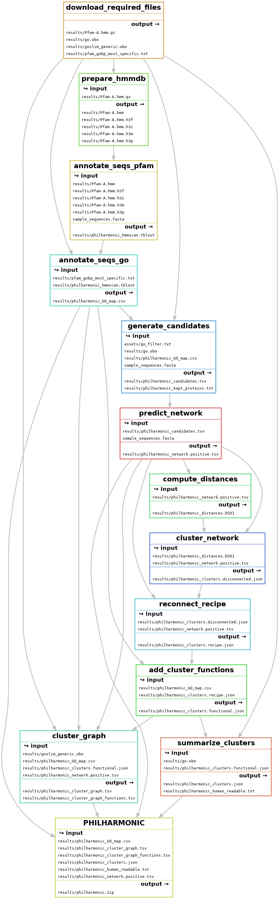
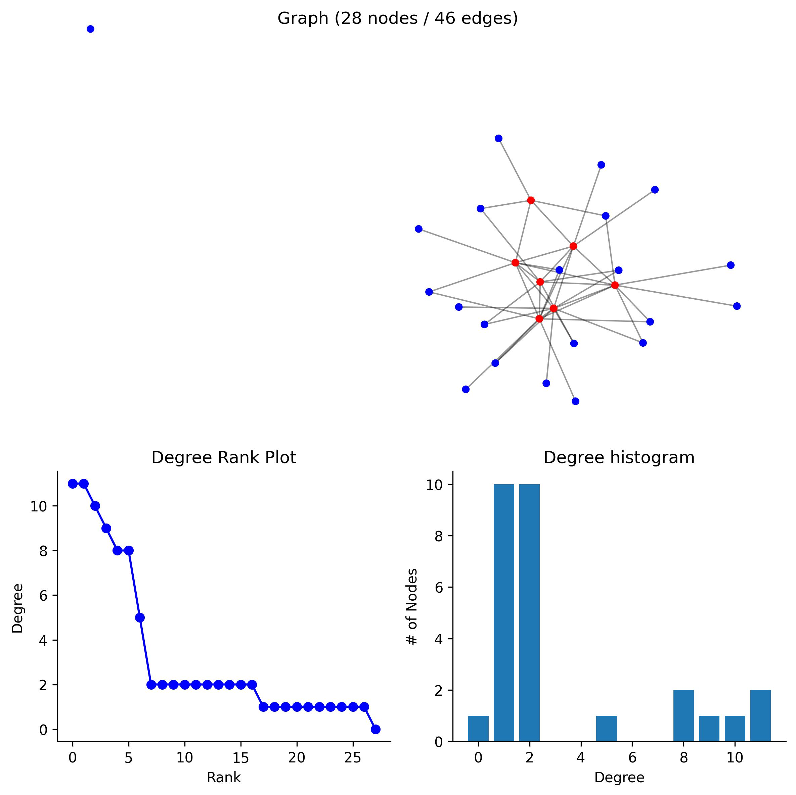
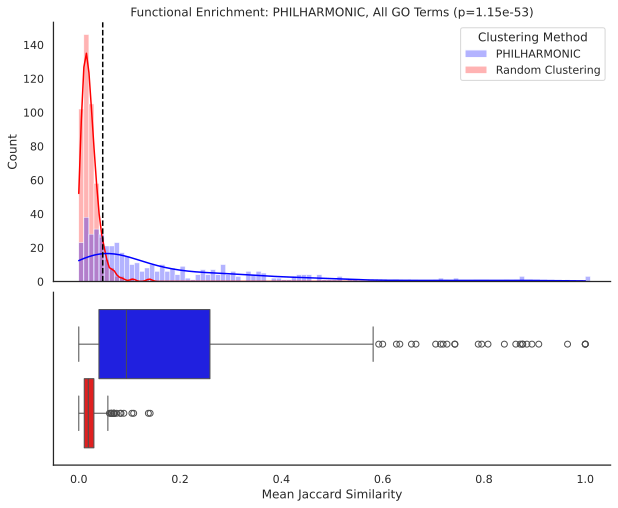
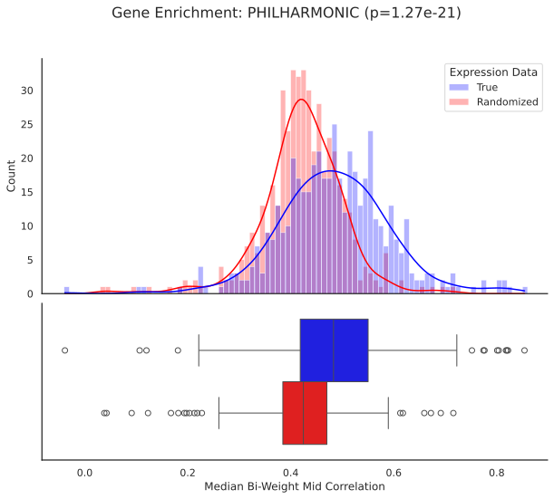
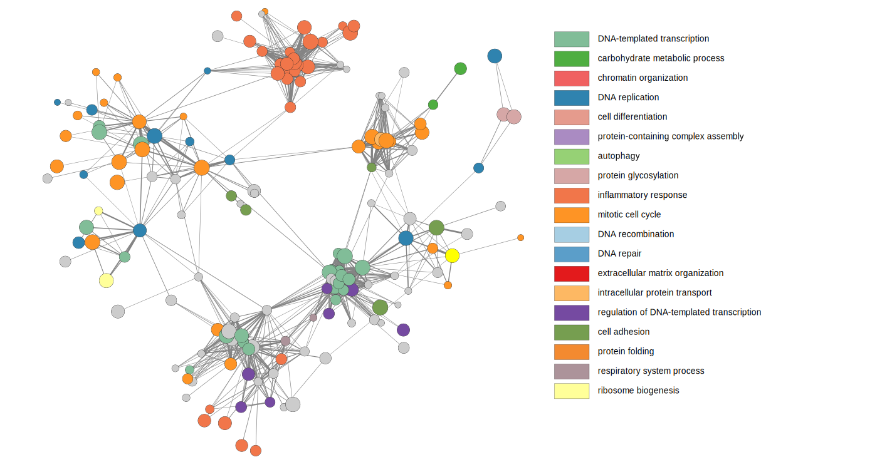

<p align="center">
    
</p>

# Decoding the Functional Networks of Non-Model Organisms

[](https://github.com/samsledje/philharmonic/releases)
[](https://github.com/samsledje/philharmonic/blob/main/LICENSE)
[](https://github.com/astral-sh/ruff)
<!-- [](https://zenodo.org/badge/latestdoi/308463847) -->

Protein-protein interaction (PPI) networks are a fundamental tool for modeling cellular and molecular function, and a large and sophisticated toolbox has been developed to leverage their structure and topological organization to predict the functional roles of under-studied genes, proteins, and pathways. However, the overwhelming majority of experimentally-determined interactions from which such networks are constructed come from a small number of well-studied model organisms. Indeed, most species lack even a single experimentally-determined interaction in these databases, much less a network to enable the analysis of cellular function. We introduce PHILHARMONIC, a novel computational pipeline that couples deep learning *de novo* network inference with robust unsupervised spectral clustering algorithms to uncover functional pathways and high-level organization in non-model organisms. PHILHARMONIC uses a [D-SCRIPT](https://dscript.csail.mit.edu) model trained on human PPIs to predict an interaction network in the target species and partitions this network into communities using [Diffusion State Distance (DSD)](https://dsd.cs.tufts.edu/capdsd/) and spectral clustering. We develop a novel algorithm called [ReCIPE](https://github.com/focitti/ReCIPE), which aims to reconnects disconnected clusters, increasing functional enrichment and biological interpretability. Finally, we perform remote homology-based functional annotation with [hhsearch](https://pubmed.ncbi.nlm.nih.gov/15531603/) and [GODomainMiner](https://godm.loria.fr), which we extend from individual proteins to the full network using these clusters. We demonstrate the ability of PHILHARMONIC to recover clusters with significant functional coherence in the reef-building coral *P. damicornis*, its algal symbiont *C. goreaui*, and the well-annotated fruit fly *D. melanogaster*. We perform a deeper analysis of the *P. damicornis* network, where we show that PHILHARMONIC clusters correlate strongly with gene co-expression and investigate several clusters that participate in temperature regulation in the coral, including the first functional annotation of several previously uncharacterized proteins. Easy to run end-to-end and requiring only a sequenced proteome, PHILHARMONIC is an engine for biological hypothesis generation and discovery in non-model organisms.

## Table of Contents

1. [Installation](#installation)
2. [Usage](#usage)
3. [Workflow Overview](#workflow-overview)
4. [Interpreting Results](#interpreting-the-results)
5. [Detailed Configuration](#detailed-configuration)
6. [Citation](#citation)
7. [FAQ/Known Issues](#issues)
8. [Contributing](#issues)

## Installation

```bash
mamba create -n philharmonic python==3.11
mamba install pytorch torchvision torchaudio pytorch-cuda=12.4 -c pytorch -c nvidia
mamba install poetry
git clone https://github.com/samsledje/philharmonic.git
cd philharmonic
poetry install --only main
```

We also recommend installing [Cytoscape](https://cytoscape.org/) to visualizing the resulting networks. You may need to swap out the pytorch-cuda version for your specific system.

## Usage

### Required data

The only data that PHILHARMONIC requires is a set of protein sequences in `.fasta` format. We provide a set of high-level GO terms on which to filter proteins prior to candidate generation and network prediction. You may optionally provide your own set of GO terms, as the `go_filter_path` argument in the configuration file.

### Setting up the config

The `config.yml` file is where you will specify the parameters for the pipeline. We provide a [sample config](config.yml) in this repository
with recommended parameters. You will need to specify the paths to your protein sequences. You can find an explanation for all parameters [below](#detailed-configuration). If you want to use an LLM to automatically name your clusters, make sure you have set the `OPENAI_API_KEY` environment variable with your API key, or set `llm.model` in the config to an open source LLM (see [llm](https://llm.datasette.io/en/stable/) package docs). If you use a different configuration file name or location, you can specify it with the `--configfile` flag when running Snakemake.

```yaml
# User Specified
run_name: [identifier for this run]
sequence_path: [path to protein sequences in .fasta format]
work_dir: [path to working directory]
use_llm: [true/false: whether to name clusters using a large language model]
...
```

### Running the pipeline

Once your configuration file is set up, you can invoke the pipeline with

```bash
snakemake -c {number of cores} --configfile {config file}
```

### Pipeline Outputs

We provide a zip of the most relevant output files in `[run].zip`, which contains the following files:

```bash
run.zip
|
|-- run_human_readable.txt # Easily readable/scannable list of clusters
|-- run_network.positive.tsv # All edges predicted by D-SCRIPT
|-- run_clusters.json # Main result file, contains all clusters, edges, and functions
|-- run_cluster_graph.tsv # Graph of clusters, where edges are weighted by the number of connections between clusters
|-- run_cluster_graph_functions.tsv # Table of high-level cluster functions from GO Slim
|-- run_GO_map.tsv # Mapping between proteins and GO function labels
```

Instructions for working with and evaluating these results can be found in [Interpreting the Results](#interpreting-the-results).

## Workflow Overview

A detailed overview of PHILHARMNONIC can be found in the [manuscript](#citation). We briefly outline the pipeline below.

Each of these steps can be invoked independently by running `snakemake -c {number of cores} --configfile {config file} {target}`. The `{target}` is shown in parentheses following each step below.



1. Download necessary files (`download_required_files`)
2. Run [hmmscan](http://hmmer.org/) on protein sequences to annotate pfam domains (`annotate_seqs_pfam`)
3. Use pfam-go associations to add [GO terms](https://geneontology.org/) to sequences (`annotate_seqs_go`)
4. Generate candidate pairs (`generate_candidates`)
5. Use [D-SCRIPT](https://dscript.csail.mit.edu/) to predict network (`predict_network`)
6. Compute node distances with [FastDSD](https://github.com/samsledje/fastDSD) (`compute_distances`)
7. Cluster the network with [spectral clustering](https://scikit-learn.org/stable/modules/generated/sklearn.cluster.SpectralClustering.html) (`cluster_network`)
8. Use [ReCIPE](https://pypi.org/project/recipe-cluster/) to reconnect clusters (`reconnect_recipe`)
9. Annotate clusters with functions (`add_cluster_functions`)
10. Compute cluster graph (`cluster_graph`)
11. Name and describe clusters for human readability (`summarize_clusters`)

## Interpreting the Results

### 1. Result Summary

<a target="_blank" href="https://colab.research.google.com/github/samsledje/philharmonic/blob/main/nb/01_result_summary.ipynb">
  
</a>

Using the `clusters.json` file, the `network.positive.tsv` file, the `GO map.tsv` file, and a [GO Slim](https://current.geneontology.org/ontology/subsets/goslim_generic.obo) database, you can view the overall network, a summary of the clustering, and explore individual clusters.

|              |         Network |
|:-------------|----------------:|
| Nodes        |   7267          |
| Edges        | 348278          |
| Degree (Med) |     37          |
| Degree (Avg) |     95.8519     |
| Sparsity     |      0.00659501 |

<p>
 
</p>

```bash
Pain Response and Signaling Pathways Cluster
Cluster of 20 proteins [pdam_00013683-RA, pdam_00006515-RA, pdam_00000216-RA, ...] (hash 208641124039621440)
20 proteins re-added by ReCIPE (degree, 0.75)
Edges: 3
Triangles: 0
Max Degree: 2
Top Terms:
		GO:0019233 - <sensory perception of pain> (20)
		GO:0048148 - <behavioral response to cocaine> (19)
		GO:0006468 - <protein phosphorylation> (19)
		GO:0007507 - <heart development> (19)
		GO:0010759 - <positive regulation of macrophage chemotaxis> (19)
		GO:0001963 - <synaptic transmission, dopaminergic> (19)
		GO:0071380 - <cellular response to prostaglandin E stimulus> (19)
		GO:0071502 - <cellular response to temperature stimulus> (19)
		GO:0008542 - <visual learning> (19)
		GO:0007601 - <visual perception> (19)
```

### 2. Functional Permutation Analysis

<a target="_blank" href="https://colab.research.google.com/github/samsledje/philharmonic/blob/main/nb/02_functional_permutation_analysis.ipynb">
  
</a>

Using the same files, you can run a statistical test of cluster function by permuting cluster labels, and computing the [Jaccard similarity](https://en.wikipedia.org/wiki/Jaccard_index) between terms in the same cluster.



### 3. g:Profiler Enrichment Analysis

<a target="_blank" href="https://colab.research.google.com/github/samsledje/philharmonic/blob/main/nb/03_gprofiler_analysis.ipynb">
  
</a>

You can view GO enrichments for each cluster using [`g:Profiler`](https://biit.cs.ut.ee/gprofiler/gost). In the provided notebook, we perform an additional mapping step to align the namespace used in our analysis with the namespace used by g:Profiler.

|    | native     | name                                         |     p_value |
|---:|:-----------|:---------------------------------------------|------------:|
|  0 | GO:0007186 | G protein-coupled receptor signaling pathway | 4.99706e-09 |
|  1 | GO:0007165 | signal transduction                          | 2.77627e-06 |
|  2 | GO:0023052 | signaling                                    | 3.17572e-06 |
|  3 | GO:0007154 | cell communication                           | 3.50392e-06 |
|  4 | GO:0051716 | cellular response to stimulus                | 1.58692e-05 |
|  5 | GO:0050896 | response to stimulus                         | 2.62309e-05 |
|  6 | GO:0050794 | regulation of cellular process               | 0.000432968 |
|  7 | GO:0050789 | regulation of biological process             | 0.00072382  |
|  8 | GO:0065007 | biological regulation                        | 0.000923115 |


### 4. Gene Expression Analysis

<a target="_blank" href="https://colab.research.google.com/github/samsledje/philharmonic/blob/main/nb/04_gene_expression_analysis.ipynb">
  
</a>

If gene expression data is available for the target species, we can check that proteins clustered together have correlated expression, and we can visualize where differentially expressed genes localize within the networks and clusters. Here, we use *Pocillopora* transcriptomic data from [Connelly et al. 2022](https://www.frontiersin.org/journals/marine-science/articles/10.3389/fmars.2021.814124/full).



### 5. View the full network in Cytoscape

1. Load `network.positive.tsv` using `File -> Import -> Network from File`

### 6. View the cluster graph in Cytoscape

1. Load `cluster_graph.tsv` using `File -> Import -> Network from File`
2. Load `cluster_graph_functions.tsv` using `File -> Import -> Table from File`
3. Add a `Column filter` on the `Edge: weight` attribute, selecting edges greater than ~50-100 weight
4. `Select -> Nodes -> Nodes Connected by Selected Edges` to subset the nodes
5. Create the subgraph with `File -> New Network -> From Selected Nodes, Selected Edges`
6. Layout the network with your layout of choice, we recommend `Layout -> Prefuse Force Directed Layout -> weight`
7. Add node colors using the [PHILHARMONIC style](assets/philharmonic_styles.xml), imported with `File -> Import -> Styles from File`



## Detailed Configuration

The `config.yml` file contains various parameters that control the behavior of the PHILHARMONIC pipeline. Below is a detailed explanation of each parameter, including default values:

### User Specified

- `run_name`: Identifier for this run [required]
- `sequence_path`: Path to protein sequences in .fasta format [required]
- `go_filter_path`: Path to list of GO terms to filter candidates (default: "assets/go_filter.txt")
- `work_dir`: Path to the working directory where results will be stored (default: "results")
- `use_llm`: Boolean flag to enable/disable LLM naming for cluster summarization (default: true)

Note: if you set `use_llm` with an OpenAI model, make sure that you have set the environment variable `OPENAI_API_KEY` prior to running.

### General Parameters

- `seed`: Random seed for reproducibility (default: 42)

### hmmscan Parameters

- `hmmscan.path`: Path to the hmmscan executable (default: "hmmscan")
- `hmmscan.threads`: Number of threads to use for hmmscan (default: 32)

### D-SCRIPT Parameters

- `dscript.path`: Path to the D-SCRIPT executable (default: "dscript")
- `dscript.n_pairs`: Number of protein pairs to predict (-1 for all pairs) (default: -1)
- `dscript.model`: Pre-trained D-SCRIPT model to use. (default: "samsl/dscript_human_v1")
- `dscript.device`: GPU device to use (-1 for CPU) (default: 0)

### DSD Parameters

- `dsd.path`: Path to the FastDSD executable (default: "fastdsd")
- `dsd.t`: Edge existence threshold for DSD algorithm (default: 0.5)
- `dsd.confidence`: Boolean flag to use confidence scores (default: true)

### Clustering Parameters

- `clustering.init_k`: Initial number of clusters for spectral clustering (default: 500)
- `clustering.min_cluster_size`: Minimum size of a cluster (default: 3)
- `clustering.cluster_divisor`: Divisor used to determine the final number of clusters (default: 20)
- `clustering.sparsity_thresh`: Sparsity threshold for filtering edges (default: 1e-5)

### ReCIPE Parameters

- `recipe.lr`: Linear ratio for ReCIPE algorithm (default: 0.1)
- `recipe.cthresh`: Connectivity threshold to add proteins until for ReCIPE (default: 0.75)
- `recipe.max_proteins`: Maximum number of proteins to add to a cluster in ReCIPE (default: 20)
- `recipe.metric`: Metric to use for ReCIPE (default: "degree")

### Langchain Parameters

- `llm.model`: Language model to use for cluster summarization (default: "gpt-4o")

## Citation

```bibtex
TBD
```

## Issues

- On Linux, the package `plac` may not install properly with the included `environment.yml`. If you are seeing the error `No module names 'asyncore'`, try running `mamba update plac`

## Contributing

```bash
mamba create -n philharmonic python==3.11
pip install poetry
git clone https://github.com/samsledje/philharmonic.git
cd philharmonic
poetry install
pre-commit install
git checkout -b [feature branch]
```
