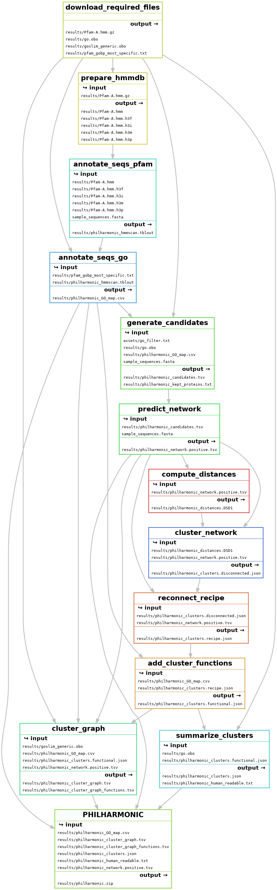
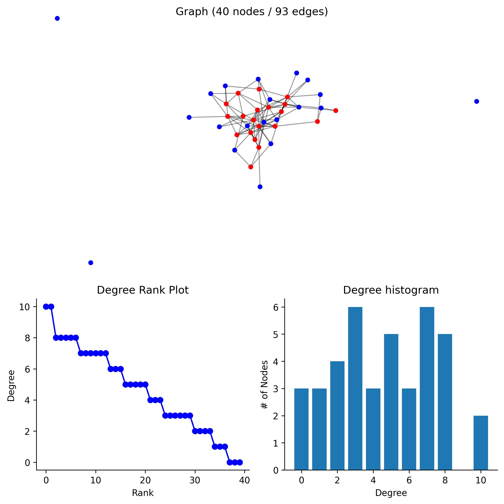

<p align="center">
    
</p>

# Decoding the Functional Networks of Non-Model Organisms

[](https://github.com/samsledje/philharmonic/releases)
[](https://github.com/samsledje/philharmonic/blob/main/LICENSE)
[](https://github.com/astral-sh/ruff)
<!-- [](https://zenodo.org/badge/latestdoi/308463847) -->

Protein interaction networks are a fundamental tool for modeling cellular and molecular function, and a large and  sophisticated toolbox has been developed to leverage the structure and topological organization of these networks to predict the functional roles of many under-studied genes, proteins and pathways. However, the overwhelming majority of experimental PPIs from which such networks are constructed come from  humans plus a small number of well-studied model organisms.

We introduce PHILHARMONIC (Protein Human-Transferred Interactome Learns Homology And Recapitulates Model Organism Network Interaction Clusters), a novel computational pipeline for de novo network inference and functional annotation in non-model organisms.

PHILHARMONIC uses [D-SCRIPT](https://dscript.csail.mit.edu) to predict a *de novo* genome-wide PPI network from amino acid sequence alone, then employs [DSD](https://dsd.cs.tufts.edu/capdsd/) coupled with Spectral Clustering followed by a new method, [ReCIPE](https://pypi.org/project/recipe-cluster/) to reconnect clusters. While the predicted PPIs will not individually be completely accurate, the clustering step allows us to aggregate the weaker pairwise signal into confident higher-level organization. We show that these clusters have substantial functional coherence, and we apply our method to predict functionally meaningful modules of proteins in the Coral Holobiont, finding interesting clusters in both the coral animal and symbiont.

## Table of Contents

1. [Installation](#installation)
2. [Usage](#usage)
3. [Workflow Overview](#workflow-overview)
4. [Interpreting Results](#interpreting-the-results)
5. [Detailed Configuration](#detailed-configuration)
6. [Citation](#citation)
7. [FAQ/Known Issues](#issues)
8. [Contributing](#issues)

## Installation

```bash
git clone https://github.com/samsledje/philharmonic.git
cd philharmonic
mamba create -f environment.yml
mamba activate philharmonic
pip install -e .
```

We also recommend installing [Cytoscape](https://cytoscape.org/) to visualizing the resulting networks.

## Usage

### Required data

The only data that PHILHARMONIC requires is a set of protein sequences in `.fasta` format. We provide a set of high-level GO terms on which to filter proteins prior to candidate generation and network prediction. You may optionally provide your own set of GO terms, as the `go_filter_path` argument in the configuration file.

### Setting up the config

The `config.yml` file is where you will specify the parameters for the pipeline. We provide a [sample config](config.yml) in this repository
with recommended parameters. You will need to specify the paths to your protein sequences. You can find an explanation for all parameters [below](#detailed-configuration). If you've installed Cytoscape, make sure it is open and running before you start the pipeline. Otherwise, set `build_cytoscape=false` in the configuration. If you use a different configuration file name or location, you can specify it with the `--configfile` flag when running Snakemake.

```yaml
# User Specified
run_name: [identifier for this run]
sequence_path: [path to protein sequences in .fasta format]
work_dir: [path to working directory]
...
```

### Running the pipeline

Once your configuration file is set up, you can invoke the pipeline with

```bash
snakemake -c {number of cores} --configfile {config file}
```

### Pipeline Outputs

We provide a zip of the most relevant output files in `[run].zip`, which contains the following files:

```bash
run.zip
|
|-- run_human_readable.txt # Easily readable/scannable list of clusters
|-- run_network.positive.tsv # All edges predicted by D-SCRIPT
|-- run_clusters.json # Main result file, contains all clusters, edges, and functions
|-- run_cluster_graph.tsv # Graph of clusters, where edges are weighted by the number of connections between clusters
|-- run_cluster_graph_functions.tsv # Table of high-level cluster functions from GO Slim
|-- run_GO_map.tsv # Mapping between proteins and GO function labels
```

Instructions for working with and evaluating these results can be found in [Interpreting the Results](#interpreting-the-results).

## Workflow Overview

A detailed overview of PHILHARMNONIC can be found in the [manuscript](#citation). We briefly outline the pipeline below.

Each of these steps can be invoked independently by running `snakemake -c {number of cores} --configfile {config file} {target}`. The `{target}` is shown in parentheses following each step below.



1. Download necessary files (`download_required_files`)
2. Run [hmmscan](http://hmmer.org/) on protein sequences to annotate pfam domains (`annotate_seqs_pfam`)
3. Use pfam-go associations to add [GO terms](https://geneontology.org/) to sequences (`annotate_seqs_go`)
4. Generate candidate pairs (`generate_candidates`)
5. Use [D-SCRIPT](https://dscript.csail.mit.edu/) to predict network (`predict_network`)
6. Compute node distances with [FastDSD](https://github.com/samsledje/fastDSD) (`compute_distances`)
7. Cluster the network with [spectral clustering](https://scikit-learn.org/stable/modules/generated/sklearn.cluster.SpectralClustering.html) (`cluster_network`)
8. Use [ReCIPE](https://pypi.org/project/recipe-cluster/) to reconnect clusters (`reconnect_recipe`)
9. Annotate clusters with functions (`add_cluster_functions`)
10. Compute cluster graph (`cluster_graph`)
11. Name and describe clusters for human readability (`summarize_clusters`)

## Interpreting the Results

### 1. Result Summary

<a target="_blank" href="https://colab.research.google.com/github/samsledje/philharmonic/blob/main/nb/01_result_summary.ipynb">
  
</a>

Using the `clusters.json` file, the `network.positive.tsv` file, the `GO map.tsv` file, and a [GO Slim](https://current.geneontology.org/ontology/subsets/goslim_generic.obo) database, you can view the overall network, a summary of the clustering, and explore individual clusters.

<table border="0" class="dataframe" align="center">
  <thead>
    <tr style="text-align: right;">
      <th></th>
      <th>Network</th>
    </tr>
    <tr>
      <th></th>
      <th></th>
    </tr>
  </thead>
  <tbody>
    <tr>
      <th>Nodes</th>
      <td>7267</td>
    </tr>
    <tr>
      <th>Edges</th>
      <td>348278</td>
    </tr>
    <tr>
      <th>Degree (Med)</th>
      <td>37.0</td>
    </tr>
    <tr>
      <th>Degree (Avg)</th>
      <td>95.851933</td>
    </tr>
    <tr>
      <th>Sparsity</th>
      <td>0.006595</td>
    </tr>
  </tbody>
</table>
 
<p align="center">
 
</p>

```bash
Cluster of 20 proteins [pdam_00013683-RA, pdam_00006515-RA, pdam_00000216-RA, ...] (hash 208641124039621440)
20 proteins re-added by ReCIPE (degree, 0.75)
Edges: 3
Triangles: 0
Max Degree: 2
Top Terms:
		GO:0019233 - <sensory perception of pain> (20)
		GO:0048148 - <behavioral response to cocaine> (19)
		GO:0006468 - <protein phosphorylation> (19)
		GO:0007507 - <heart development> (19)
		GO:0010759 - <positive regulation of macrophage chemotaxis> (19)
		GO:0001963 - <synaptic transmission, dopaminergic> (19)
		GO:0071380 - <cellular response to prostaglandin E stimulus> (19)
		GO:0071502 - <cellular response to temperature stimulus> (19)
		GO:0008542 - <visual learning> (19)
		GO:0007601 - <visual perception> (19)
```

### 2. Functional Permutation Analysis

<a target="_blank" href="https://colab.research.google.com/github/samsledje/philharmonic/blob/main/nb/02_functional_permutation_analysis.ipynb">
  
</a>

Using the same files, you can run a statistical test of cluster function by permuting cluster labels, and computing the [Jaccard similarity](https://en.wikipedia.org/wiki/Jaccard_index) between terms in the same cluster.


### 3. g:Profiler Enrichment Analysis

<a target="_blank" href="https://colab.research.google.com/github/samsledje/philharmonic/blob/main/nb/03_gprofiler_analysis.ipynb">
  
</a>

You can view GO enrichments for each cluster using [`g:Profiler`](https://biit.cs.ut.ee/gprofiler/gost). In the provided notebook, we perform an additional mapping step to align the namespace used in our analysis with the namespace used by g:Profiler.

<table border="1" class="dataframe">
  <thead>
    <tr style="text-align: right;">
      <th>native</th>
      <th>name</th>
      <th>p_value</th>
      <th>description</th>
    </tr>
  </thead>
  <tbody>
    <tr>
      <td>GO:0007186</td>
      <td>G protein-coupled receptor signaling pathway</td>
      <td>0.000038</td>
      <td>"The series of molecular signals initiated by a ligand binding to its receptor, in which the activated receptor promotes the exchange of GDP for GTP on the alpha-subunit of an associated heterotrimeric G-protein complex. The GTP-bound activated alpha-G-protein then dissociates from the beta- and gamma-subunits to further transmit the signal within the cell. The pathway begins with receptor-ligand interaction, and ends with regulation of a downstream cellular process. The pathway can start from the plasma membrane, Golgi or nuclear membrane." [GOC:bf, GOC:mah, PMID:16902576, PMID:24568158, Wikipedia:G_protein-coupled_receptor]</td>
    </tr>
    <tr>
      <td>GO:0007165</td>
      <td>signal transduction</td>
      <td>0.000250</td>
      <td>"The cellular process in which a signal is conveyed to trigger a change in the activity or state of a cell. Signal transduction begins with reception of a signal (e.g. a ligand binding to a receptor or receptor activation by a stimulus such as light), or for signal transduction in the absence of ligand, signal-withdrawal or the activity of a constitutively active receptor. Signal transduction ends with regulation of a downstream cellular process, e.g. regulation of transcription or regulation of a metabolic process. Signal transduction covers signaling from receptors located on the surface of the cell and signaling via molecules located within the cell. For signaling between cells, signal transduction is restricted to events at and within the receiving cell." [GOC:go_curators, GOC:mtg_signaling_feb11]</td>
    </tr>
    <tr>
      <td>GO:0023052</td>
      <td>signaling</td>
      <td>0.000278</td>
      <td>"The entirety of a process in which information is transmitted within a biological system. This process begins with an active signal and ends when a cellular response has been triggered." [GOC:mtg_signal, GOC:mtg_signaling_feb11, GOC:signaling]</td>
    </tr>
    <tr>
      <td>GO:0007154</td>
      <td>cell communication</td>
      <td>0.000300</td>
      <td>"Any process that mediates interactions between a cell and its surroundings. Encompasses interactions such as signaling or attachment between one cell and another cell, between a cell and an extracellular matrix, or between a cell and any other aspect of its environment." [GOC:mah]</td>
    </tr>
    <tr>
      <td>GO:0051716</td>
      <td>cellular response to stimulus</td>
      <td>0.000956</td>
      <td>"Any process that results in a change in state or activity of a cell (in terms of movement, secretion, enzyme production, gene expression, etc.) as a result of a stimulus. The process begins with detection of the stimulus by a cell and ends with a change in state or activity or the cell." [GOC:bf, GOC:jl]</td>
    </tr>
    <tr>
      <td>GO:0050896</td>
      <td>response to stimulus</td>
      <td>0.001406</td>
      <td>"Any process that results in a change in state or activity of a cell or an organism (in terms of movement, secretion, enzyme production, gene expression, etc.) as a result of a stimulus. The process begins with detection of the stimulus and ends with a change in state or activity or the cell or organism." [GOC:ai, GOC:bf]</td>
    </tr>
    <tr>
      <td>GO:0050794</td>
      <td>regulation of cellular process</td>
      <td>0.012037</td>
      <td>"Any process that modulates the frequency, rate or extent of a cellular process, any of those that are carried out at the cellular level, but are not necessarily restricted to a single cell. For example, cell communication occurs among more than one cell, but occurs at the cellular level." [GOC:go_curators]</td>
    </tr>
    <tr>
      <td>GO:0050789</td>
      <td>regulation of biological process</td>
      <td>0.017826</td>
      <td>"Any process that modulates the frequency, rate or extent of a biological process. Biological processes are regulated by many means; examples include the control of gene expression, protein modification or interaction with a protein or substrate molecule." [GOC:ai, GOC:go_curators]</td>
    </tr>
    <tr>
      <td>GO:0065007</td>
      <td>biological regulation</td>
      <td>0.021465</td>
      <td>"Any process that modulates a measurable attribute of any biological process, quality or function." [GOC:dph, GOC:isa_complete, GOC:mah, GOC:pr, GOC:vw]</td>
    </tr>
  </tbody>
</table>

### 4. Gene Expression Analysis

<a target="_blank" href="https://colab.research.google.com/github/samsledje/philharmonic/blob/main/nb/04_gene_expression_analysis.ipynb">
  
</a>

If gene expression data is available for the target species, we can check that proteins clustered together have correlated expression, and we can visualize where differentially expressed genes localize within the networks and clusters. Here, we use *Pocillopora* transcriptomic data from [Connelly et al. 2022](https://www.frontiersin.org/journals/marine-science/articles/10.3389/fmars.2021.814124/full).


### 4. View the full network in Cytoscape

1. Load `network.positive.tsv` using `File -> Import -> Network from File`

### 5. View the cluster graph in Cytoscape

1. Load `cluster_graph.tsv` using `File -> Import -> Network from File`
2. Load `cluster_graph_functions.tsv` using `File -> Import -> Table from File`
3. Add a `Column filter` on the `Edge: weight` attribute, selecting edges greater than ~50-100 weight
4. `Select -> Nodes -> Nodes Connected by Selected Edges` to subset the nodes
5. Create the subgraph with `File -> New Network -> From Selected Nodes, Selected Edges`
6. Layout the network with your layout of choice, we recommend `Layout -> Prefuse Force Directed Layout -> weight`
7. Add node colors using the [PHILHARMONIC style](assets/philharmonic_styles.xml), imported with `File -> Import -> Styles from File`


## Detailed Configuration

The `config.yml` file contains various parameters that control the behavior of the PHILHARMONIC pipeline. Below is a detailed explanation of each parameter, including default values:

### User Specified

- `run_name`: Identifier for this run [required]
- `sequence_path`: Path to protein sequences in .fasta format [required]
- `work_dir`: Path to the working directory where results will be stored (default: "results")
- `use_cytoscape`: Boolean flag to enable/disable Cytoscape visualization (default: false)
- `use_langchain`: Boolean flag to enable/disable Langchain for cluster summarization (default: false)

### General Parameters

- `seed`: Random seed for reproducibility (default: 6191998)

### hmmscan Parameters

- `hmmscan.path`: Path to the hmmscan executable (default: "hmmscan")
- `hmmscan.threads`: Number of threads to use for hmmscan (default: 16)

### D-SCRIPT Parameters

- `dscript.path`: Path to the D-SCRIPT executable (default: "dscript")
- `dscript.n_pairs`: Number of protein pairs to predict (-1 for all pairs) (default: -1)
- `dscript.model`: Pre-trained D-SCRIPT model to use. (default: "samsl/human_v1")
- `dscript.device`: GPU device to use (-1 for CPU) (default: 0)

### DSD Parameters

- `dsd.path`: Path to the FastDSD executable (default: "fastdsd")
- `dsd.t`: Edge existence threshold for DSD algorithm (default: 0.5)
- `dsd.confidence`: Boolean flag to use confidence scores (default: true)

### Clustering Parameters

- `clustering.init_k`: Initial number of clusters for spectral clustering (default: 500)
- `clustering.min_cluster_size`: Minimum size of a cluster (default: 3)
- `clustering.cluster_divisor`: Divisor used to determine the final number of clusters (default: 20)
- `clustering.sparsity_thresh`: Sparsity threshold for filtering edges (default: 1e-5)

### ReCIPE Parameters

- `recipe.lr`: Linear ratio for ReCIPE algorithm (default: 0.1)
- `recipe.cthresh`: Connectivity threshold to add proteins until for ReCIPE (default: 0.75)
- `recipe.max_proteins`: Maximum number of proteins to add to a cluster in ReCIPE (default: 20)
- `recipe.metric`: Metric to use for ReCIPE (default: "degree")

### Langchain Parameters

- `langchain.model`: Language model to use for cluster summarization (default: "gpt-4o")

## Citation

```bibtex
TBD
```

## Issues

- On Linux, the package `plac` may not install properly with the included `environment.yml`. If you are seeing the error `No module names 'asyncore'`, try running `mamba update plac`

## Contributing

```bash
git clone https://github.com/samsledje/philharmonic.git
cd philharmonic
mamba create -f environment.yml
mamba activate philharmonic
pip install -e .
mamba install -c conda-forge pre-commit
pre-commit install
git checkout -b [feature branch]
```
